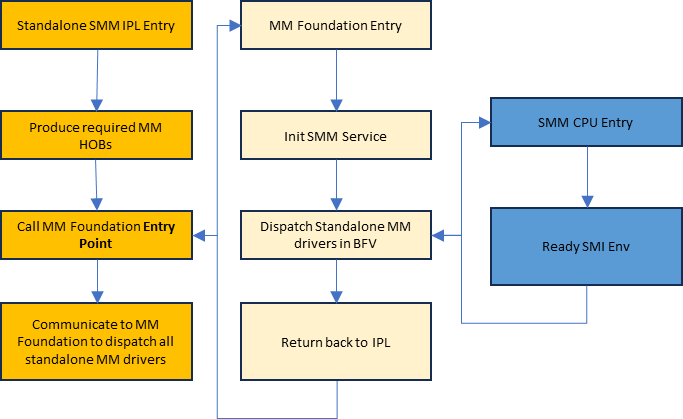

<!--- @file
  First Chapter of Getting Started Guide for Standalone MM on X86 Systems

  Copyright (c) 2025, Intel Corporation. All rights reserved. 

  Redistribution and use in source (original document form) and 'compiled'
  forms (converted to PDF, epub, HTML and other formats) with or without
  modification, are permitted provided that the following conditions are met:

  1) Redistributions of source code (original document form) must retain the
     above copyright notice, this list of conditions and the following
     disclaimer as the first lines of this file unmodified.

  2) Redistributions in compiled form (transformed to other DTDs, converted to
     PDF, epub, HTML and other formats) must reproduce the above copyright
     notice, this list of conditions and the following disclaimer in the
     documentation and/or other materials provided with the distribution.

  THIS DOCUMENTATION IS PROVIDED BY TIANOCORE PROJECT "AS IS" AND ANY EXPRESS OR
  IMPLIED WARRANTIES, INCLUDING, BUT NOT LIMITED TO, THE IMPLIED WARRANTIES OF
  MERCHANTABILITY AND FITNESS FOR A PARTICULAR PURPOSE ARE DISCLAIMED. IN NO
  EVENT SHALL TIANOCORE PROJECT  BE LIABLE FOR ANY DIRECT, INDIRECT, INCIDENTAL,
  SPECIAL, EXEMPLARY, OR CONSEQUENTIAL DAMAGES (INCLUDING, BUT NOT LIMITED TO,
  PROCUREMENT OF SUBSTITUTE GOODS OR SERVICES; LOSS OF USE, DATA, OR PROFITS;
  OR BUSINESS INTERRUPTION) HOWEVER CAUSED AND ON ANY THEORY OF LIABILITY,
  WHETHER IN CONTRACT, STRICT LIABILITY, OR TORT (INCLUDING NEGLIGENCE OR
  OTHERWISE) ARISING IN ANY WAY OUT OF THE USE OF THIS DOCUMENTATION, EVEN IF
  ADVISED OF THE POSSIBILITY OF SUCH DAMAGE.

-->

# 1 MM Introduction

## 1.1 SMM and MM Overview

This section describes the main differences between Traditional SMM and Standalone MM on X86 systems. A detailed comparison of the Traditional MM and Standalone MM load process is described in the PI Specification sections "Initializing Management Mode in MM Traditional Mode" and "Initializing Management Mode in Standalone Mode" respectively.

In the following comparison, we will use "SMM" to represent "Traditional SMM" and "MM" to represent "Standalone MM".

SMM Driver:

- Module type is `DXE_SMM_DRIVER`. The entry point of an SMM driver follows the UEFI specification `EFI_IMAGE_ENTRY_POINT`.
- SMM driver can access the DXE, UEFI, and SMM services during initialization, but can only access SMM services during runtime.
- Launches at the DXE phase, because SMM might have dependencies on DXE.
- Multiple rounds of dispatch depend on the `gEfiEventDxeDispatchGuid` event.
- Uses PEI HOBs.
- No memory protection before the end of DXE: `PiSmmCore` installs the `EDKII_PI_SMM_MEMORY_ATTRIBUTES_TABLE` at the `gEfiEndOfDxeEventGroupGuid` event.
- Can access non-MMRAM memory types at runtime: `EfiReservedMemoryType`, `EfiRuntimeServicesData`, and `EfiACPIMemoryNVS`.

MM Driver:

- Module type is `MM_STANDALONE`. The entry point of an updatable MM driver follows the PI specification `MM_IMAGE_ENTRY_POINT`.
- A Standalone MM driver must only refer to MM servers.
- Launches early in the PEI phase.
- Two rounds of dispatch depend on the `gEventMmDispatchGuid` event. Refer to section **1.2 MM Driver Dispatch** for details.
- Cannot access any non-MMRAM memory unless the `MmUnblockMemoryRequest()` API is called for the non-MMRAM memory. Refer to section **1.4 Non-MMRAM Access** for details.
- Uses MM self-owned HOBs. Refer to section **1.5 MM HOBs** for details.
- Early memory protection in PEI: `StandaloneMmCore` installs the `EDKII_PI_SMM_MEMORY_ATTRIBUTES_TABLE` once the second round of dispatch finishes. Refer to section **1.7 Memory Protection** for details.

## 1.2 MM Driver Dispatch

For traditional SMM drivers dispatch on X86 systems, they are dispatched within multiple rounds: The dispatch is hooked on the `gEfiEventDxeDispatchGuid` event, which is signaled by DXE Core when DXE Core finishes one round of dispatch.

`StandaloneMmIpl` is a PEIM responsible for locating and loading `StandaloneMmCore`. All the MM drivers are dispatched by `StandaloneMmCore` in the 2-round dispatches in X86:

- **1st round**: `StandaloneMmCore` dispatches MM drivers in its IPL entry point running in non-SMM mode. It exits to `StandaloneMmIpl` after `PiSmmCpuStandaloneMm` installs the SMI handler in its entry point.
- **2nd round**: `StandaloneMmIpl` triggers SMI (`gEventMmDispatchGuid`) to inform `StandaloneMmCore` to dispatch the remaining MM drivers in SMM mode in its SMI entry point.

The following flow chart describes the MM driver dispatch flow:

###### Figure 1: MM Driver Dispatch Flow

## 1.3 MM Communication Buffer

MM communication buffer is specific memory regions used for communication between the Non-MM and MM environment.

Traditional SMM Communication Buffer can be allocated by each DXE driver. It can be any `EfiReservedMemoryType`, `EfiRuntimeServicesData` or `EfiACPIMemoryNVS` runtime buffer. SMI Handlers directly access them. There is no protection of access/call out before `EndOfDxe`.

Standalone MM introduces a more secure method for handling MM Communication Buffer. `StandaloneMmIpl` is responsible for allocating and unblocking a fixed size of runtime memory (non-MMRAM) for `CommBuffer` (`MdeModulePkg/Include/Guid/MmCommBuffer.h`) between non-MM and MM. `StandaloneMmCore` allocates a shadowed communication buffer in MMRAM accordingly. The `CommBuffer` will be used by the MM Communication PPI and Protocol.

Every communication flow is as follows where steps #2, #3, and #4 run inside MM:

1. Non-MM code modifies the `CommBuffer` and triggers MMI.
2. `StandaloneMmCore` copies the content to the shadowed one in MMRAM and calls the corresponding MMI handler.
3. MMI handler accesses the shadowed `CommBuffer` in MMRAM.
4. Upon returning of the MMI handler, `StandaloneMmCore` copies the updated content in the shadowed buffer to the `CommBuffer` in non-MMRAM.
5. Upon returning to non-MM mode, non-MM code reads the `CommBuffer`.

By following the above, the `CommBuffer` used by the Communication PPI/Protocol is referred to as the **Primary Buffer**. Additionally, other non-MMRAM memory for specific MM driver usage are termed **Non-Primary Buffer**. Those buffer can be pointed from the MM HOBs, or pointed from the `CommBuffer`. Both the Primary Buffer and Non-Primary Buffer used by MM drivers should be validated for accessibility before use.

## 1.4 Non-MMRAM Access

Any memory outside of the MMRAM (non-MMRAM) that needs to be accessed by MMI handlers must be explicitly declared as "Unblock Mem" through `MmUnblockMemoryRequest()` (`MdePkg/Include/Library/MmUnblockMemoryLib.h`).

Requirements for marking the non-MMRAM as "Unblocked":

1. The memory must be allocated and unblocked in the Post-Mem phase and before the gEfiPeiMmCommunicationPpiGuid is installed.
2. The memory must be runtime-accessible and cannot be reclaimed by the OS.

`StandaloneMmIpl` builds the corresponding `EFI_HOB_RESOURCE_DESCRIPTOR` in the MM HOB list for all unblocked non-MMRAM memory access. Any non-MMRAM memory region that is not described by `EFI_HOB_RESOURCE_DESCRIPTOR` in the MM HOB list is not accessible from SMM mode.

## 1.5 MM HOBs

PEI HOBs are used by the traditional SMM. The lifecycle of traditional SMM HOBs is limited to the boot phase, and once entering the runtime phase, HOBs can no longer be accessed or used in the SMM. In contrast, Standalone MM is designed to maintain the validity of its self-owned HOBs throughout the entire lifecycle, including the runtime phase.

`StandaloneMmIpl` is not required to pass the entire PEI HOB list to the SMM foundation. Instead, it must create and pass a specific subset of HOBs that are essential for the operation of the Standalone MM environment. Overall, MM self-owned HOBs can be divided into two categories: **MM Foundation HOBs** and **MM Platform HOBs**.

### 1.5.1 MM Foundation HOBs

The MM Foundation HOBs are a set of HOBs that are created by the common logic within the `StandaloneMmIpl`. These HOBs provide the necessary information about the firmware environment and memory regions that the MM Core and drivers will interact with. The following HOBs are created by `StandaloneMmIpl` common logic; hence, they should **NOT** be created by the platform part:

- Single GUIDed (`gEfiSmmSmramMemoryGuid`) HOB to describe the MM regions.
- Single `EFI_HOB_TYPE_MEMORY_ALLOCATION` (`gEfiHobMemoryAllocModuleGuid`) HOB to describe the MM region of MM Core.
- Single `EFI_HOB_TYPE_FV` to describe the BFV where MM Core resides if there is no MM FV HOB created by the platform.
- Multiple `EFI_HOB_RESOURCE_DESCRIPTOR` HOBs to describe the non-MM regions and their access permissions. All accessible non-MM regions should be described by `EFI_HOB_RESOURCE_DESCRIPTOR` HOBs.
- Single `EFI_HOB_TYPE_MEMORY_ALLOCATION` (`gMmProfileDataHobGuid`) HOB to describe the MM profile data region. This region is to log the non-MM regions marked with the `MM_RESOURCE_ATTRIBUTE_LOGGING` attribute in `EFI_HOB_RESOURCE_DESCRIPTOR` HOBs once they are accessed in MM.
- Single GUIDed (`gMmCommBufferHobGuid`) HOB to identify the MM Communication buffer (`CommBuffer`) in the non-MM region.
- Multiple GUIDed (`gSmmBaseHobGuid`) HOBs to describe the SMM base address of each processor.
- Multiple GUIDed (`gMpInformation2HobGuid`) HOBs to describe the MP information.
- Single GUIDed (`gMmCpuSyncConfigHobGuid`) HOB to describe how BSP synchronizes with APs in x86 SMM.
- Single GUIDed (`gMmAcpiS3EnableHobGuid`) HOB to describe the ACPI S3 enable status.
- Single GUIDed (`gEfiAcpiVariableGuid`) HOB to identify the S3 data root region in x86.
- Single GUIDed (`gMmStatusCodeUseSerialHobGuid`) HOB to describe whether the status code uses the serial port or not.

### 1.5.2 MM Platform HOBs

In addition to the MM Foundation HOBs, the `StandaloneMmIpl` will consume the `MmPlatformHobProducerLib/CreateMmPlatformHob()` to create platform-specific HOBs that are necessary for the Standalone MM environment. These HOBs provide information and configuration details that are unique to the platform on which the system is running. The creation of these HOBs ensures that the MM environment is properly configured to interact with the platform's hardware and firmware features.

## 1.6 Communication between SMM/Non-SMM
The following mechanisms are provided for communication between SMM and Non-SMM:

1. Using `CommBuffer` with Protocol `EFI_MM_COMMUNICATION_PROTOCOL` or PPI `EFI_PEI_MM_COMMUNICATION_PPI`:
   - Requires dependency on the `EFI_MM_COMMUNICATION_PROTOCOL` or `EFI_PEI_MM_COMMUNICATION_PPI`.
   - Triggers an SMI when sharing data between SMM and Non-SMM code.

2. Using "Unblock Mem":
   - Must meet the usage requirements. Refer to section **1.4 Non-MMRAM Access** for details.

3. Using MM Guided HOBs:
   - For data sizes < 64KB: Embed the data directly into the HOB.

Option #1 is suitable when the data cannot be finalized before launching MM or when the data flow is bidirectional between SMM and Non-SMM code. Option #2 is necessary for ASL code to pass data to the SW SMI handler. It is also an alternative solution to avoid triggering an SMI for latency considerations. Option #3 is ideal when the data size is small than 64K and it can be finalized before launching MM and the data flow is unidirectional between SMM and Non-SMM code.

But in cases where silicon initialization code does not want to rely on the communication PPI, the data size to be passed to MM exceeds 64KB, and the memory cannot be runtime-accessible due to the requirement for Runtime Non-SMM invisibility, then options #1 and #2 are not applicable. Option #3 requires splitting the data into multiple Guided HOBs, which increases code complexity due to the need to reassemble the data in MM. To simplify this, a fourth method was introduced as below:

4. Using MM Memory Allocation HOBs with BSData and Non-Zero GUID:
   - Memory Producer (PEIM): Create a Memory Allocation HOB pointing to a BSData memory region and assign a Non-Zero GUID to the corresponding HOB.
   - MM Core: Migrate the Memory Allocation HOB into MMRAM by copying the data from Non-MMRAM to MMRAM. Refer to `MigrateMemoryAllocationHobs()` in `Edk2/StandaloneMmPkg/Core/StandaloneMmCore.c`.
   - Memory Consumer (MM Drivers): Retrieve the memory from the Memory Allocation HOB using its assigned Non-Zero GUID.

## 1.7 Memory Protection

The `PiSmmCpuStandaloneMm` driver creates a page table used in MM mode according to the `EFI_HOB_RESOURCE_DESCRIPTOR` in the MM HOB list. The newly created page table controls memory accessibility in MM.

The following table outlines the differences in memory protection policies between the traditional SMM and the Standalone MM. Note: this comparison is particularly relevant for x86 systems and highlights the security enhancements provided by Standalone MM.

| Items                        | Policy                                      | SMM                          | MM                           |
|------------------------------|---------------------------------------------|------------------------------|------------------------------|
| **DRAM**                     | CommBuffer & Unblock Mem: non-executable, Writable. Others Mem: Non-Present | EndOfDxe               | End of CpuMm.Entrypoint       |
| **MMIO**                     | Non-Executable, Writable                   | EndOfDxe               | End of CpuMm.Entrypoint       |
| **SMRAM**                    | Code: Read-only, Executable. Data: Writable, non-executable | EndOfDxe               | End of MmIpl.Entrypoint       |
| **Code Check (MSR[4E0h].BIT2)** | Forbidden call-out                        | EndOfDxe               | End of CpuMm.Entrypoint       |
| **SMRR (MSR[1F2h])**         | Forbidden access-in                        | End of CpuMm.Entrypoint       | End of CpuMm.Entrypoint       |
| **SMM Paging State (MSR[141h].BIT0)** | Lock SMM paging state                  | EndOfDxe               | End of MmIpl.Entrypoint       |

###### Table 1: SMM and MM Memory Protection Policy