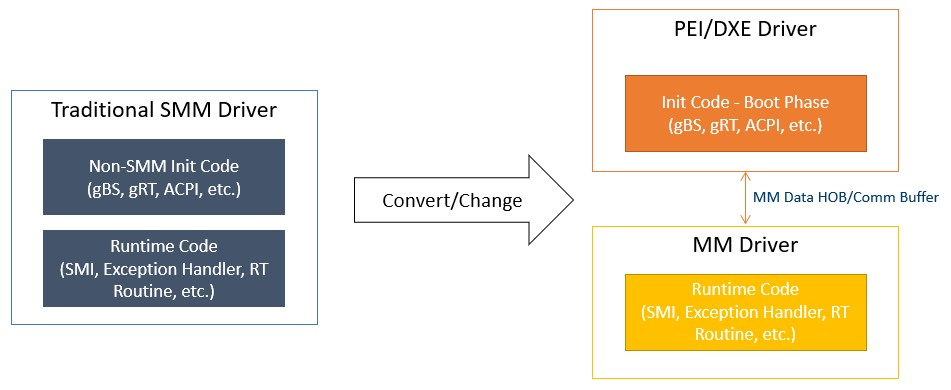
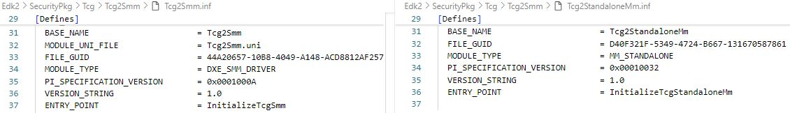
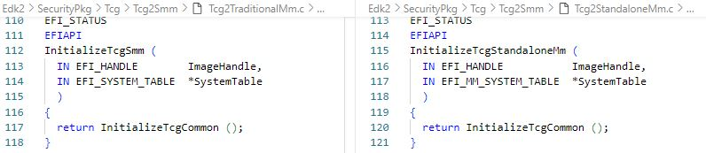
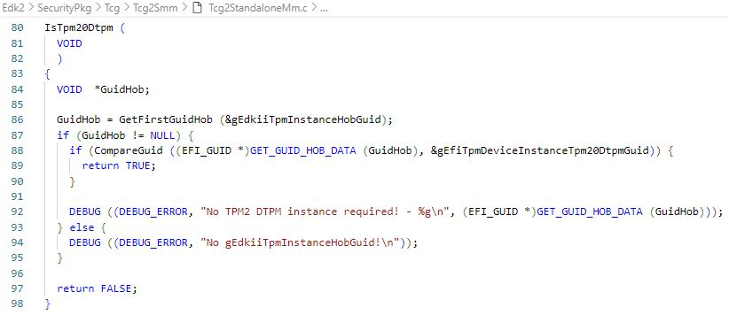

<!--- @file
  First Chapter of Getting Started Guide for Standalone MM on X86 Systems

  Copyright (c) 2025, Intel Corporation. All rights reserved. 

  Redistribution and use in source (original document form) and 'compiled'
  forms (converted to PDF, epub, HTML and other formats) with or without
  modification, are permitted provided that the following conditions are met:

  1) Redistributions of source code (original document form) must retain the
     above copyright notice, this list of conditions and the following
     disclaimer as the first lines of this file unmodified.

  2) Redistributions in compiled form (transformed to other DTDs, converted to
     PDF, epub, HTML and other formats) must reproduce the above copyright
     notice, this list of conditions and the following disclaimer in the
     documentation and/or other materials provided with the distribution.

  THIS DOCUMENTATION IS PROVIDED BY TIANOCORE PROJECT "AS IS" AND ANY EXPRESS OR
  IMPLIED WARRANTIES, INCLUDING, BUT NOT LIMITED TO, THE IMPLIED WARRANTIES OF
  MERCHANTABILITY AND FITNESS FOR A PARTICULAR PURPOSE ARE DISCLAIMED. IN NO
  EVENT SHALL TIANOCORE PROJECT  BE LIABLE FOR ANY DIRECT, INDIRECT, INCIDENTAL,
  SPECIAL, EXEMPLARY, OR CONSEQUENTIAL DAMAGES (INCLUDING, BUT NOT LIMITED TO,
  PROCUREMENT OF SUBSTITUTE GOODS OR SERVICES; LOSS OF USE, DATA, OR PROFITS;
  OR BUSINESS INTERRUPTION) HOWEVER CAUSED AND ON ANY THEORY OF LIABILITY,
  WHETHER IN CONTRACT, STRICT LIABILITY, OR TORT (INCLUDING NEGLIGENCE OR
  OTHERWISE) ARISING IN ANY WAY OUT OF THE USE OF THIS DOCUMENTATION, EVEN IF
  ADVISED OF THE POSSIBILITY OF SUCH DAMAGE.

-->

# 2 SMM to MM Porting Guide

## 2.1 Porting Design Overview

This section provides instructions on how to convert traditional SMM drivers to MM drivers on X86 systems. A traditional SMM driver may need to be split into one or more drivers when transitioning to a Standalone MM driver:

1. **PEI/DXE Driver**: If the traditional SMM driver contains non-MM initialization code:
   - The PEI driver can be used to either unblock memory or prepare required data for runtime code and pass the data via HOB or Comm PPI/Protocol.
   - The DXE driver might be needed to handle any requirements involving `gBS`, `gDS`, `gRT`, or ACPI-related services.

2. **Standalone MM Driver**: Abstracted from the traditional SMM driver.

The figure below illustrates how to convert a traditional SMM driver to an MM driver:

###### Figure 2: SMM to MM Conversion

## 2.2 Checkpoints in Converted MM Driver

To ensure the converted Standalone MM driver is functional, the following checkpoints should be verified:

1. **Checkpoint 1: Check Access to Dynamic PCD**

   Dynamic PCD cannot be used in Standalone MM as it relies on services from the PEI or DXE phases, violating the independence principle of Standalone MM. Instead:
   - Use static PCD or feature PCD.
   - Alternatively, store the PCD value in a HOB and retrieve it in Standalone MM.

2. **Checkpoint 2: Confirm Necessary HOBs Have Been Migrated to MM HOB Database**

   Refer to section **1.5 MM HOBs** for details.
   **Note**: HOB creation cannot depend on the end of the PEI notify event if the HOB needs to be accessed in MM. This is because the `StandaloneMmIpl` PEIM is dispatched before the end of PEI, leaving no opportunity for the IPL to migrate newly created HOBs to the MM HOB database.

3. **Checkpoint 3: Check Dependencies on `gBS`, `gDS`, `gRT`, or ACPI-Related Services**

   If the original SMM driver depends on DXE protocols (e.g., `gBS` or `gDS`), it can only be used during the DXE phase. And ACPI tables must be installed during the DXE phase.

4. **Checkpoint 4: Check Access to Non-MMRAM**

   Non-MMRAM access typically falls into the following cases:
   - **Case 1**: Accessing a HOB that contains a pointer or address pointing to non-MMRAM.
     Use `MmUnblockMemoryRequest()` in the PEI phase before the `StandaloneMmIpl` entry point to allow access to the buffer from the MM environment.
   - **Case 2**: The registered SMI handler uses `gMmst->MmiHandlerRegister(SmiHandler, &CommunicationGuid, ...)`.
     If it accesses another buffer pointed from the `CommBuffer`, modify the MM driver to embed all communication data within the `CommBuffer` itself.
   - **Case 3**: The registered SMI handler uses `gMmst->MmiHandlerRegister(SmiHandler, NULL, ...)` or MM Child Dispatch protocols (e.g., `SwDispatch->Register`).
     If it accesses any non-MMRAM buffer, use `MmUnblockMemoryRequest()` in the PEI phase before the `StandaloneMmIpl` entry point.

5. **Checkpoint 5: Validate Primary & Non-Primary Buffers**

   Refer to section **1.3 MM Communication Buffer** for definitions of Primary and Non-Primary Buffers. Both types of buffers used by MM drivers should be validated for accessibility before use:
   - Use `XXXIsPrimaryBufferValid()` to validate the `CommBuffer`.
   - Use `XXXIsNonPrimaryBufferValid()` to validate non-MMRAM memory pointed from the `CommBuffer` or MM HOB.

## 2.3 Sample: SMM to MM Conversion

The Tcg2 SMM and MM modules will be used as a sample to highlight the key points to consider when converting a traditional SMM module to an MM module:

- `Edk2\SecurityPkg\Tcg\Tcg2Smm\Tcg2Smm.inf`
- `Edk2\SecurityPkg\Tcg\Tcg2Smm\Tcg2StandaloneMm.inf`

1. **Module Type**

   Traditional SMM uses `MODULE_TYPE = DXE_SMM_DRIVER`.
   Standalone MM uses `MODULE_TYPE = MM_STANDALONE`.

   
   ###### Figure 3: Tcg2 SMM and MM Module Type

2. **Entry Point**

   Traditional SMM uses the `EFI_IMAGE_ENTRY_POINT` entry point.
   Standalone MM uses the `MM_IMAGE_ENTRY_POINT` entry point.

   
   ###### Figure 4: Tcg2 SMM and MM Entry Point

3. **HOB to Replace Dynamic PCD**

   Refer to **Checkpoint 1**.
   The `gEdkiiTpmInstanceHobGuid` is built for the value from the dynamic PCD (`PcdTpmInstanceGuid`) in the PEI module (`Edk2\SecurityPkg\Tcg\Tcg2Config\Tcg2ConfigPei.inf`). It will be used to replace the dynamic PCD usage.

   
   ###### Figure 5: Tcg2 HOB to Replace PCD

4. **Handle ACPI-Related Operations in DXE Driver**

   There is a requirement to provide ACPI methods for TPM 2.0 support. The DXE driver needs to locate the MM communication buffer and protocol, then use it to exchange information with `Tcg2StandaloneMm` on the NVS address and SMI value.
   Details can be found in `Edk2\SecurityPkg\Tcg\Tcg2Acpi\Tcg2Acpi.inf`.

5. **Handle `gBS`-Related Services in DXE Driver**

   Traditional SMM can install `gTcg2MmSwSmiRegisteredGuid` directly by leveraging the `gBS` service in the SMM driver entry point.
   For Standalone MM, a new DXE driver is required to install `gTcg2MmSwSmiRegisteredGuid` to notify the readiness of the Standalone MM Tcg2 module.
   Details can be found in `Edk2\SecurityPkg\Tcg\Tcg2Smm\Tcg2MmDependencyDxe.inf`.

6. **Unblock Non-MMRAM for MM Access**

   The `mTcgNvs` global variable in the Tcg2 SMM module plays a crucial role in TPM operations, especially when updating the ACPI table and handling SMI callback functions.
   `mTcgNvs` is the operation region in the TCG ACPI table and must be a non-MMRAM memory buffer pointed from the `CommBuffer`.
   According to Section **1.4 Non-MMRAM Access**, it must be unblocked using `MmUnblockMemoryRequest()`.
   The related operation can be found in the `BuildTcg2AcpiCommunicateBufferHob()` function in `Edk2\SecurityPkg\Tcg\Tcg2Config\Tcg2ConfigPei.inf`.

7. **Check Primary & Non-Primary Buffer Validity**

   According to **Checkpoint 5**, define `Tcg2IsPrimaryBufferValid()` and `Tcg2IsNonPrimaryBufferValid()` to validate the Primary and Non-Primary Buffers.

   
   ###### Figure 6: Tcg2 Primary and Non-Primary Buffer Check